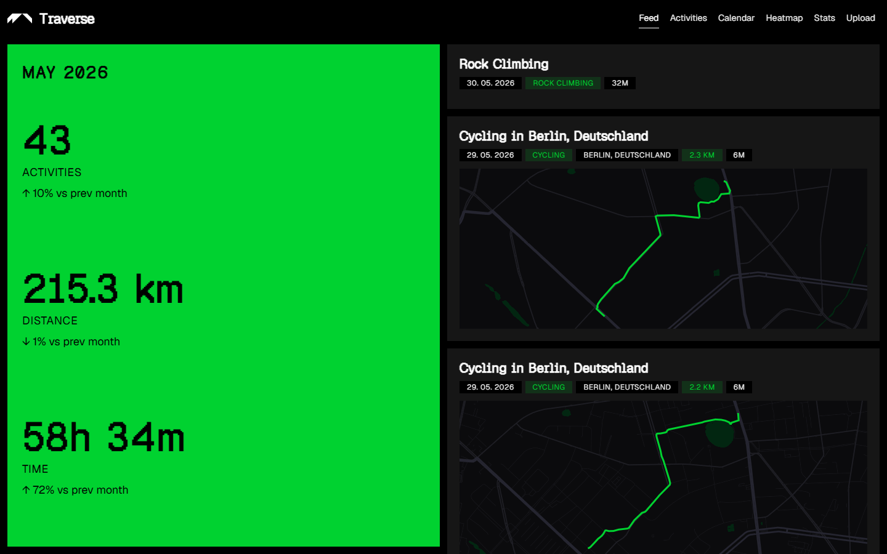
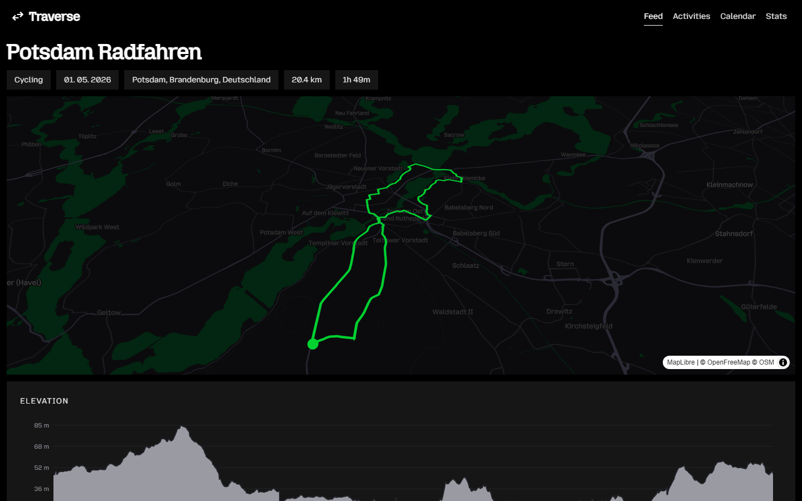
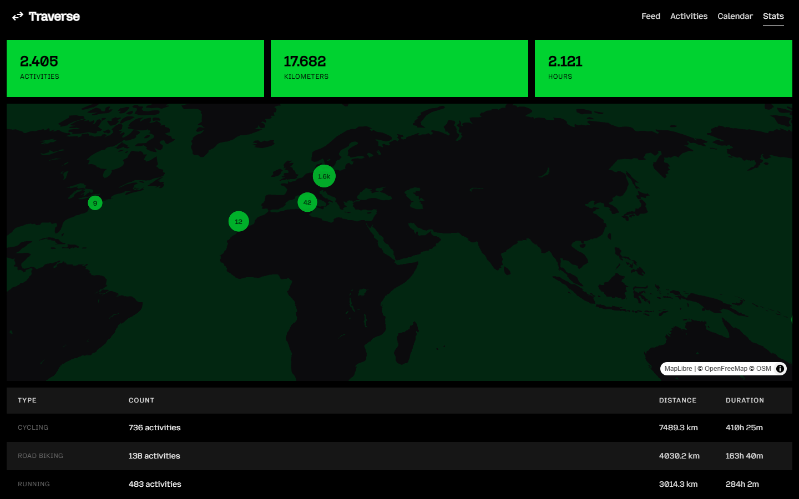
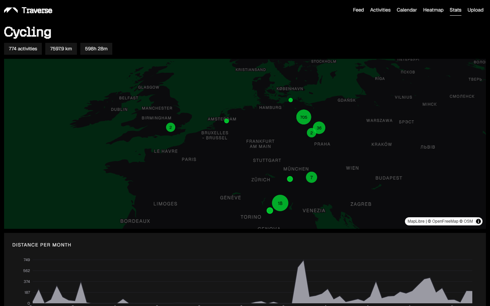

# Traverse

Self-hosted viewer for FIT/GPX/TCX activities.






## Setup

```
npm install
```

## Usage

### Build the index

```
npm run build:index
```

Builds generated artifacts:

- `activity-index.json` (activity index for the viewer)
- `heatmap-data.json` (precomputed heatmap points by activity type)

During indexing:

- FIT, GPX, and TCX files are used for route/track points and heatmap generation.
- Duration/HR/calories are taken from FIT, GPX, or TCX data.

Activity locations are reverse geocoded via OpenStreetMap Nominatim. Results are cached, so only new activities get geocoded on subsequent runs.

### Start the viewer

```
npm start
```

Opens `http://localhost:3000` with:

- Searchable, filterable activity list
- Activity detail pages with map and stats
- Stats overview with world map (clustered) and per-type breakdowns with charts

## Docker

A Docker image is published to GitHub Container Registry when a version tag is pushed (e.g., `git tag v1.0.0 && git push --tags`).

### Pull and run

```
docker run -d \
  -p 3000:3000 \
  -v /data/traverse:/app/data \
  ghcr.io/philippfromme/traverse:latest
```

Your data directory should contain:

```
/data/traverse/
  fit/                  FIT files
  gpx/                  GPX files
  tcx/                  TCX files
  activity-index.json   Generated on first start (persisted automatically)
  heatmap-data.json     Generated on first start (persisted automatically)
```

The server builds `activity-index.json` and `heatmap-data.json` automatically on first start if they don't exist. On subsequent starts, only new activities are processed.

Drop new FIT, GPX, or TCX files into the mounted data directories and the index rebuilds automatically within a few seconds — no restart needed.

### Build locally

```
docker compose up --build
```

Or manually:

```
docker build -t traverse -f docker/Dockerfile .
docker run -d -p 3000:3000 -v /path/to/data:/app/data traverse
```

## Releasing

```
npm run release
```

Uses [np](https://github.com/sindresorhus/np) to bump the version, create a git tag, and push. The GitHub Action then builds and publishes the Docker image to GHCR.
